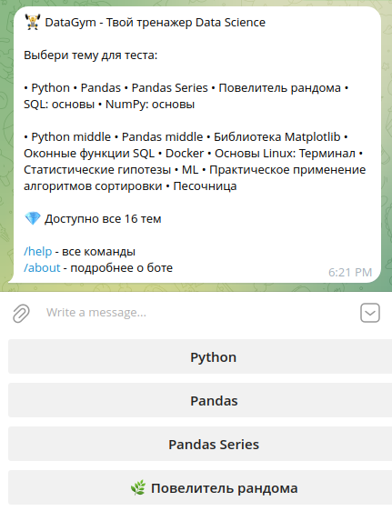
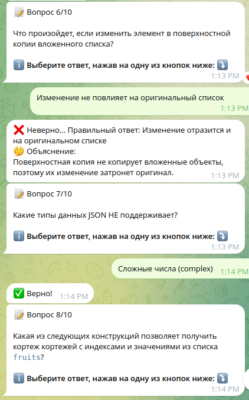
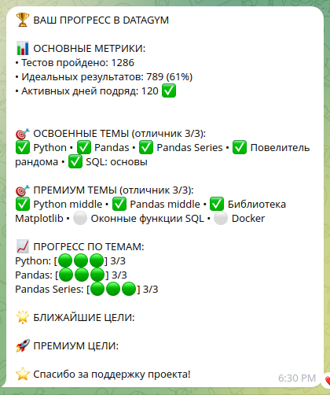
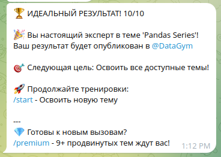
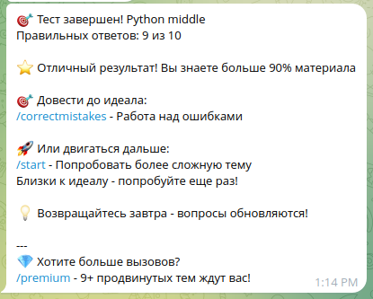
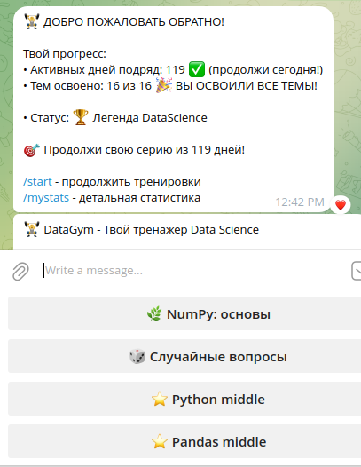

# DataGym - Тренажер Data Science  

> Telegram бот с 1000+ вопросами для ежедневной практики Data Science  

## 🎯 О проекте
DataGym помогает специалистам Data Science поддерживать и улучшать навыки через систему микро-обучения. Проходите тесты, отслеживайте прогресс и становитесь экспертом!  

## 🚀 Попробовать DataGym
**🎯 Live Demo**: [@skillbox_datascience_bot](https://t.me/skillbox_datascience_bot)  

**Основные команды:**
- `/start` - начать тест
- `/mystats` - моя статистика
- `/premium` - премиум доступ
- `/help` - справка

## 📊 Возможности
- **1082+ вопроса** по 15+ темам Data Science
- **Персональная статистика** прогресса
- **Работа над ошибками** - учитесь на своих ошибках
- **Система достижений** и ежедневный streak
- **Premium темы** - ML, Docker, Linux, Python middle

## 📈 История обновлений

### v3.19.0 (2025-10-23)
- **ПАМЯТЬ**: Добавлена защита от утечек памяти
- **ОПТИМИЗАЦИЯ**: Автоматическая очистка user_states после тестов
- **СТАБИЛЬНОСТЬ**: Ограничение истории сессий (100 на пользователя)
- **МОНИТОРИНГ**: Система отслеживания использования памяти

### v3.18.0 (2025-10-23)  
- **СТАБИЛЬНОСТЬ**: Упрощена сетевая логика для работы на ограниченных хостингах
- **ОПТИМИЗАЦИЯ**: Увеличены таймауты polling (10/120 секунд)
- **НАДЕЖНОСТЬ**: Добавлен skip_pending для предотвращения конфликтов

### v3.17.0 (2025-10-21)
- **СТРАТЕГИЯ**: Добавлен продуманный онбординг в сообщество
- **UX**: Кликабельные ссылки на канал t.me/datascience_gym
- **УДЕРЖАНИЕ**: Четкое ценностное предложение с 3 выгодами подписки

### v3.16.0 (2025-10-21)
- **БЕЗОПАСНОСТЬ**: Полная защита от новых пользователей
- **СТАБИЛЬНОСТЬ**: Исправлены критические KeyError
- **АРХИТЕКТУРА**: Защищены ключевые функции статистики

## 📱 Интерфейс DataGym

### 🏠 Главное меню
  
*Выбор темы для тестирования - 15+ тем от Python до ML*

### ❓ Пример вопроса
   
*Вопрос с вариантами ответов и экранированием Markdown*

### 📊 Статистика пользователя
  
*Персональный прогресс, цели и достижения*

### 🎉 Успешное завершение теста
  
*Поздравление с идеальным результатом 10/10*

### 💡 Завершение с ошибками
  
*Адаптивная обратная связь и рекомендации*

### 👋 Умное приветствие
  
*Персонализированное сообщение при возвращении*  

## 🛠 Технологии
- Python 3.8+
- pyTelegramBotAPI
- JSON для хранения данных

## 📦 Установка
1. Клонируйте репозиторий 
git clone https://github.com/kali-krit/datagym-edtech.git  

2. Установите зависимости 
pip install -r requirements.txt  

3. Настройте конфигурацию 
cp config_example.py config.py  
отредактируйте config.py - добавьте Telegram токен  

4. Запустите бота 
python -m src.bot  

## 📈 Статистика проекта
- 1082 вопроса и постоянно растущая база
- 15+ тем от основ Python до продвинутого ML
- Ежедневные обновления и новые вопросы

3 режима обучения: 
- тесты
- случайные вопросы
- работа над ошибками

## 🎯 Для кого этот проект
- Студенты Data Science 
- Junior/Middle специалисты 
- Все, кто хочет поддерживать навыки в тонусе  

📄 Лицензия 
MIT
